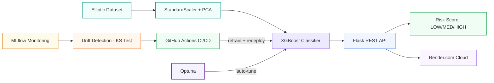

<p align="center">
  
  
  
  
  
  
  
</p>

<h1 align="center">Anti-Money Laundering Detection<br>on Bitcoin Transactions</h1>

<p align="center">
  <strong>MLOps Pipeline — From Model to Production</strong><br>
  <em>DLBDSMTP01 · IU International University of Applied Sciences</em>
</p>

<p align="center">
  <strong>Iman Jouhar</strong><br>
  Task 3 — Fraud Detection (Spotlight: MLOps)
</p>

---

## Project overview

End-to-end machine learning pipeline that detects illicit Bitcoin transactions on the blockchain. Built with production-grade MLOps: automated retraining, drift detection, REST API serving, experiment tracking, and cloud deployment.

| | |
|---|---|
| **Goal** | Detect illicit Bitcoin transactions with automated retraining |
| **Dataset** | Elliptic Bitcoin — 203K real blockchain transactions |
| **Model** | XGBoost + PCA with Optuna auto-tuning |
| **Serving** | Flask REST API with API key auth + Docker |
| **MLOps** | MLflow tracking, KS drift detection, GitHub Actions CI/CD |
| **Deploy** | Docker Compose + Render.com cloud |

---

## Workflow



---

## How to run

### 1. Clone and setup
```bash
git clone https://github.com/imanjouhar/aml-fraud-detection.git
cd aml-fraud-detection
python3.11 -m venv venv
source venv/bin/activate
pip install -r requirements.txt
```

### 2. Download dataset

Download from Kaggle and place 3 CSVs in `data/`:
> https://www.kaggle.com/datasets/ellipticco/elliptic-data-set

### 3. Run the full pipeline
```bash
python main.py
```

This trains the model, saves the drift baseline, runs the 12-month simulation, and opens the interactive dashboard automatically.
---

## All commands

| Command | What it does |
|---------|-------------|
| `python main.py` | Full pipeline (train → simulate → dashboard) |
| `python main.py train` | Train XGBoost with default parameters |
| `python main.py tune` | Auto-tune hyperparameters with Optuna |
| `python main.py api` | Start REST API at http://localhost:5000 |
| `python main.py simulate` | Run 12-month drift simulation |
| `python main.py dashboard` | Open interactive EDA dashboard |
| `python main.py send` | Stream test transactions to API |
| `python main.py test` | Run automated test suite |
| `python main.py monitor` | Launch MLflow UI at http://localhost:5001 |
| `python main.py demo` | Quick train + single prediction |

---

## Interactive dashboard

Served at http://localhost:5000/dashboard with live refresh button.
Includes:
- Dataset stats and model metrics (radar + bar chart)
- 3D interactive PCA scatter (drag to rotate)
- Feature importance with 95% cumulative coverage
- Confusion matrix with TP/TN/FP/FN color coding
- 12-month drift simulation chart with retraining events
- System architecture ERD diagram

---

## System architecture
The prediction pipeline flows left to right: Elliptic data → Scaler + PCA → XGBoost → Flask API → Risk score (LOW/MED/HIGH). The MLOps layer monitors for distribution drift using the KS statistical test. When drift exceeds 30% of features, GitHub Actions automatically retrains and redeploys the model.

---

## Dataset

**Elliptic Bitcoin Dataset** — real blockchain transactions labeled by Elliptic, a cryptocurrency analytics company.

| Property | Value |
|----------|-------|
| Source | Elliptic via Kaggle |
| Total transactions | 203,769 |
| Labeled | ~46,500 |
| Illicit | 4,545 (~9.8%) |
| Licit | 42,019 (~90.2%) |
| Features | 165 anonymized (94 local + 71 aggregated) |
| Time steps | 49 (~2 weeks each) |
| Graph edges | 234,355 directed payment flows |

---

## Model

| Component | Detail |
|-----------|--------|
| Preprocessing | StandardScaler → PCA (165 → 30 components) |
| Graph features | time_step, in_degree, out_degree |
| Classifier | XGBClassifier |
| Auto-tune | Optuna (30 trials, optimizes 6 hyperparameters) |
| Imbalance | scale_pos_weight (~9:1) |
| Metric | AUCPR |

---

## REST API

```bash
python main.py api
```

| Method | Endpoint | Auth | Description |
|--------|----------|------|-------------|
| GET | /health | No | API status |
| GET | /dashboard | No | Interactive dashboard |
| POST | /predict | API Key | Score one transaction |
| POST | /predict/batch | API Key | Score multiple transactions |

### Live streaming test

```bash
# Terminal 1
python main.py api

# Terminal 2
python main.py send
```
---

## Drift detection and retraining

The KS two-sample test compares each month's data against the training baseline. When 30%+ of features drift, retraining is triggered automatically.

| Period | Drift level | What changes |
|--------|------------|--------------|
| Months 1–3 | None | Stable baseline |
| Months 4–6 | Mild | Noise injection |
| Months 7–9 | Moderate | Feature scaling + noise |
| Months 10–12 | Strong | Heavy scaling + label perturbation |
---

## Auto-tuning

```bash
python main.py tune
```

Optuna searches 30 combinations of n_estimators, max_depth, learning_rate, min_child_weight, subsample, and colsample_bytree. Selects the configuration with the highest F1 score. Best parameters saved to `models/best_params.json`.

---

## Docker

### Docker Compose (API + Sender)
```bash
docker compose up --build
docker compose down
```

Services:
- **API** — Flask at http://localhost:5000
- **Sender** — streams transactions to API
- **Dashboard** — http://localhost:5000/dashboard

---

## Testing

```bash
python main.py test
```
Verifies: model artifacts, drift baseline, visualizations, simulation (12 months), API health, auth rejection, CI/CD files.

---

## Cloud deployment

Deployed on **Render.com** using Docker:

- Dashboard: `https://your-app.onrender.com/dashboard`
- API: `https://your-app.onrender.com/predict`
- Health: `https://your-app.onrender.com/health`

---

## Project structure

```
aml-fraud-detection/
├── main.py                     All logic (train, tune, api, drift, simulate, send, test)
├── visualize.py                Interactive Plotly dashboard + static charts
├── models/                     Trained artifacts (.pkl + .json)
├── data/                       Elliptic CSVs (not in git)
├── visualizations/             Dashboard HTML + PNG charts

├── .github/workflows/retrain.yml   CI/CD pipeline
├── Dockerfile
├── docker-compose.yml
├── requirements.txt
├── .dockerignore
├── .gitignore
├── LICENSE
└── README.md
```

---

## Course

| | |
|---|---|
| **Course** | DLBDSMTP01 — Project: From Model to Production |
| **University** | IU International University of Applied Sciences |
| **Task** | 3 — Fraud Detection (Spotlight: MLOps) |
| **Author** | Iman Jouhar |

---

## License

MIT — see [LICENSE](LICENSE)